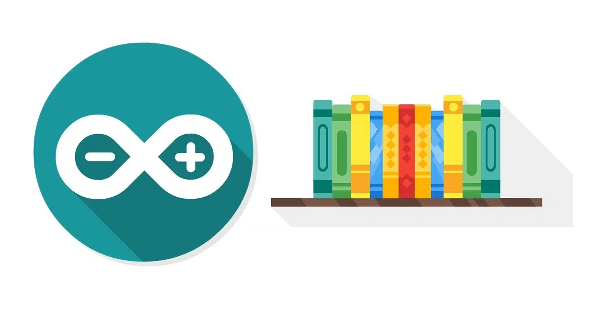

## Arduino Libraries Tooter 🐘

Just like its [Twitter counterpart](https://twitter.com/ArduinoLibs), this app publishes the latest changes found in [Arduino Library Registry](https://www.arduino.cc/reference/en/libraries/) on [Mastodon](https://github.com/mastodon/mastodon).

Requirements:
  - php8+
  - composer
  - Mastodon TOKEN

Dependencies:
  - https://github.com/Eleirbag89/MastodonBotPHP
  - https://github.com/halaxa/json-machine
  - https://github.com/vlucas/phpdotenv

Resources:
  - https://downloads.arduino.cc/libraries/library_index.json.gz
  - https://www.arduino.cc/reference/en/libraries/
  - https://github.com/arduino/library-registry

Inspiration:
  - https://twitter.com/ArduinoLibs
  - https://github.com/njh
  - https://www.arduinolibraries.info/

